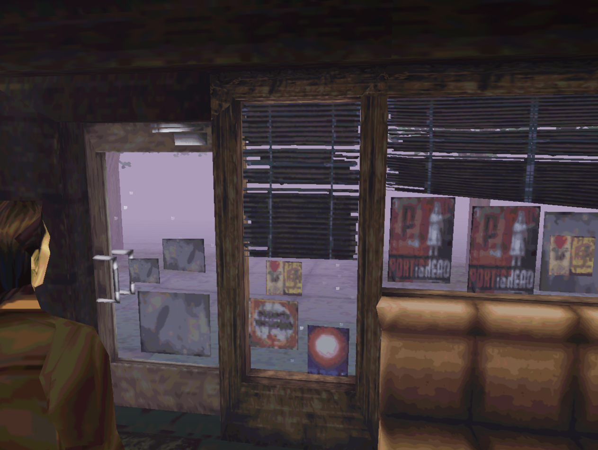

<h1 align="center">[  Hi there 🐙 ]</h1>

<table style="width:100%; border:none;">
<tr>
<td style="width:50%; vertical-align:top; border:none;">
    

        
    

</td>
<td style="width:50%; vertical-align:top; border:none;">
    <h2 align="center"> 🎆 About me </h2>

    

        
    

    <b>Name:</b> Nikolai Maryin (@maryin_n in telegram)  

    <b>My hobbies:</b> coding, reading books, listening to music  

    <b>I love:</b> both Nintendo and Sega, as well as PlayStation 1 and 2, old PC is nice too  

    <b>Favorite:</b>
    <ul>
        <li>musicians - RHCP, Three Days Grace, Span</li>
        <li>author - Agatha Christie</li>
        <li>games - Warcraft 2 and FlatOut 2</li>
    </ul>
</td>
</tr>
</table>

  

<table style="width:100%; border:none;">
<tr>
<td style="width:50%; vertical-align:top; border:none;">
    

        
    

</td>
<td style="width:50%; vertical-align:top; border:none;">
    <h2 align="center">🦀 About coding 🦞</h2>

    <b>Course:</b> I'm in my second year now  

    <b>Institute:</b> I'm studying in MathMeh’e, field of mathematical software (with a strong focus on programming)  

    <b>I want to learn:</b> I want to learn SQL, HTML, CSS, and GUI development  

    <b>I use:</b> Bash, C++, JavaScript, Java, and Python to solve my training tasks
</td>
</tr>
</table>

  

### 🚀 Languages & Tools

  <!-- Languages -->
  
  
  
  
  

  <!-- IDEs -->
  
  

