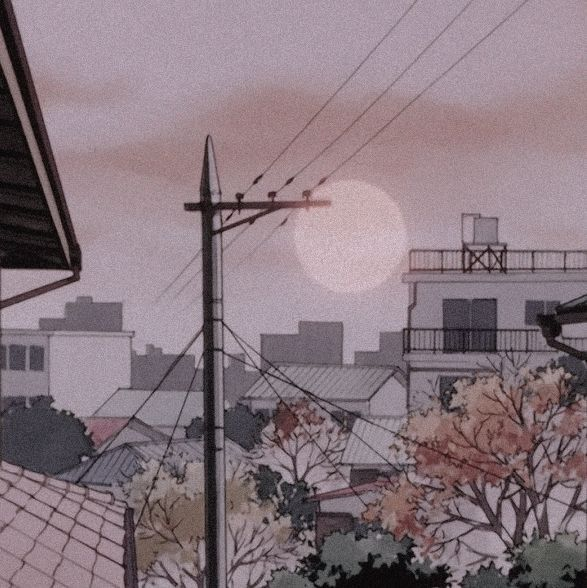

<body>
<h1 align="center">[  Hi there 🐙 ]</h1>

    

 

<h2 align="center"> 🎆 About me </h2>

    

<b>Name:</b> Nikolai Maryin

<b>I use:</b> Bash, C++, JavaScript, Java, and Python to solve my training tasks

<b>My hobbies:</b> coding, reading books, listening to music

<b>I love:</b> both Nintendo and Sega, as well as PlayStation 1 and 2

   

</body>